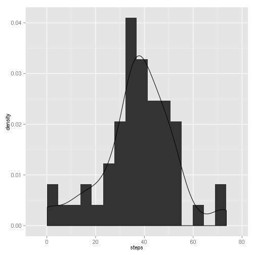
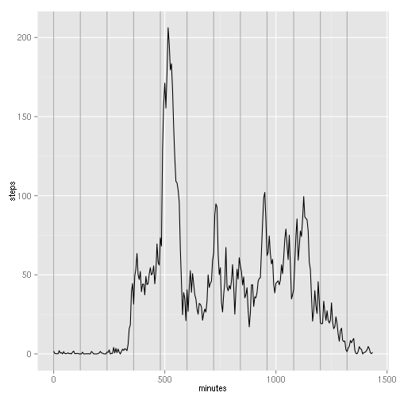
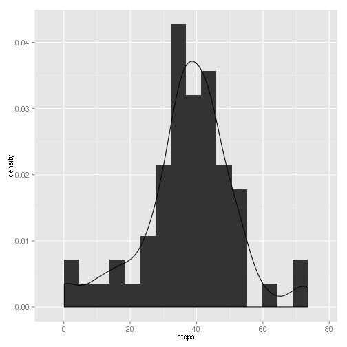
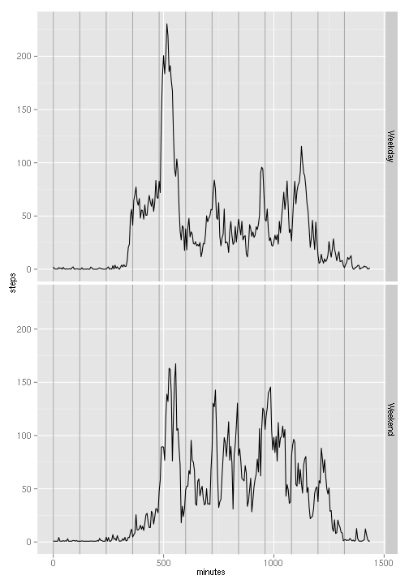

This document presents the analyses on data from an anonymous individual on his personal [Activity monitoring data](https://d396qusza40orc.cloudfront.net/repdata%2Fdata%2Factivity.zip), retrieved on December 5, 2014 from the associated url. Especifically, the activity recorded corresponds to the number of steps taken by the person on 5 minute intervals.

The goal of these analyses is to identify whether there are certain patterns in this person's activity during the day. Additionally, this document illustrates the use of [R Markdown] (http://rmarkdown.rstudio.com/) and [knitr] (http://yihui.name/knitr/) as tools for literate programming.

The following code sets some global options for the document and the analyses.

```r
# # Global variables
inPath  <- './input'
figPath <- './PA1_template_files/figure-html/'

# # Load packages
library("ggplot2")
library("xtable")
```


## 1. Loading and preprocessing the data
Firstly, the data will be loaded and preprocessed for the anlyses. The following code loads and examines the data.

```r
activityFile <- 'activity.csv'
dataActivity <- read.csv(file.path(inPath, activityFile))

str(dataActivity)
```

```
## 'data.frame':	17568 obs. of  3 variables:
##  $ steps   : int  NA NA NA NA NA NA NA NA NA NA ...
##  $ date    : Factor w/ 61 levels "2012-10-01","2012-10-02",..: 1 1 1 1 1 1 1 1 1 1 ...
##  $ interval: int  0 5 10 15 20 25 30 35 40 45 ...
```

As presented above, there are three variables in the dataset: *steps*, *date*, and *interval*.
Given that the date has the format "yyyy-mm-dd", the next code process it into a date variable according to that format.


```r
dataActivity[, 'date'] <- as.Date(dataActivity[, 'date'], '%Y-%m-%d')
```

The following code shows some detail on the values of each variable.


```r
print(xtable(summary(dataActivity[, c('steps', 'interval', 'date')])),
      type = 'html', include.rownames = FALSE)
```

<!-- html table generated in R 3.1.2 by xtable 1.7-3 package -->
<!-- Sun Dec  7 00:35:57 2014 -->
<TABLE border=1>
<TR> <TH>     steps </TH> <TH>    interval </TH> <TH>      date </TH>  </TR>
  <TR> <TD> Min.   :  0.0   </TD> <TD> Min.   :   0   </TD> <TD> Min.   :2012-10-01   </TD> </TR>
  <TR> <TD> 1st Qu.:  0.0   </TD> <TD> 1st Qu.: 589   </TD> <TD> 1st Qu.:2012-10-16   </TD> </TR>
  <TR> <TD> Median :  0.0   </TD> <TD> Median :1178   </TD> <TD> Median :2012-10-31   </TD> </TR>
  <TR> <TD> Mean   : 37.4   </TD> <TD> Mean   :1178   </TD> <TD> Mean   :2012-10-31   </TD> </TR>
  <TR> <TD> 3rd Qu.: 12.0   </TD> <TD> 3rd Qu.:1766   </TD> <TD> 3rd Qu.:2012-11-15   </TD> </TR>
  <TR> <TD> Max.   :806.0   </TD> <TD> Max.   :2355   </TD> <TD> Max.   :2012-11-30   </TD> </TR>
  <TR> <TD> NA's   :2304   </TD> <TD>  </TD> <TD>  </TD> </TR>
   </TABLE>

It should be noted that there are several missing data for the steps variable, and that the data covers a period of two months:

1. October 2012

2. November 2012


```r
dataActivity[, 'day']     <- weekdays.Date(dataActivity[, 'date'])
dataActivity[, 'weekend'] <- dataActivity[, 'day'] %in% c('Saturday', 'Sunday')
```


## 2. What is mean total number of steps taken per day?

Firstly, we wish to know broadly the amount of steps taken by this person each day. The following code obtains the histogram and basic descriptives of the daily average steps.


```r
dailyActivity <- aggregate(dataActivity[, 'steps'],
                           by = list(date = dataActivity[, 'date']),
                           mean, na.rm = TRUE)

names(dailyActivity)[names(dailyActivity) == 'x'] <- 'steps'

histogramSteps <- ggplot(dailyActivity[complete.cases(dailyActivity), ],
                         aes(x = steps, y = ..density..))
histogramSteps <- histogramSteps + geom_histogram(binwidth = 4.6)
histogramSteps <- histogramSteps + geom_density()
histogramSteps
```

 

```r
summSteps <- summary(dailyActivity[, 'steps'], na.rm = TRUE)
summSteps
```

```
##    Min. 1st Qu.  Median    Mean 3rd Qu.    Max.    NA's 
##    0.14   30.70   37.40   37.40   46.20   73.60       8
```

The distribution of steps per day clearly skews towards the left, as seen in the histogram; however, the numeric summary shows that the mean and median are equal (37.4) and both the quartiles, and the minimum and maximum, are about equally separate from them. The average number of steps on a five-minute interval ranges from almost none to about 75, per day.


## 3. What is the average daily activity pattern?

To see if there is a pattern on the activity for this person during the day, a plot on the average number of steps taken on each of the 288 five-minute intervals is presented --as a function of the number of minutes, rather than the interval label.
Vertical lines in the plot depict 2-hour intervals.


```r
intervalActivity <- aggregate(dataActivity[, 'steps'],
                              by = list(interval = dataActivity[, 'interval']),
                           mean, na.rm = TRUE)

names(intervalActivity)[names(intervalActivity) == 'x'] <- 'steps'
intervalActivity[, 'minutes'] <- seq(0, 5*287, length = 288)

timeSeriesPlot <- ggplot(intervalActivity[complete.cases(intervalActivity), ],
                         aes(x = minutes, y = steps))
timeSeriesPlot <- timeSeriesPlot + geom_vline(xintercept = seq(from = 0,
                                                               length = 12,
                                                               by = 120),
                                              colour = 'darkgrey')
timeSeriesPlot <- timeSeriesPlot + geom_line()

timeSeriesPlot
```

 

```r
maxSteps <- which(intervalActivity[, 'steps'] == max(intervalActivity[, 'steps']))

timeMax  <- intervalActivity[maxSteps, 'interval']
hourMax  <- floor(timeMax/100)
minMax   <- 100 * ((timeMax/100) - hourMax)
stepsMax <- intervalActivity[maxSteps, 'steps']
```

It may be noted that there is a high peak of activity after 8am. Particularly, the highest number of steps occurs, on average, for the five-minute interval beginning at 8:35am, with 206.1698 steps.
Several smaller peaks occur at noon, 4pm, and around 7pm.

## 4. Imputing missing values
As noted above, there are several hundreds of missing observations in the steps variable in the data set.
Especifically, there are 2304 missing observations.

The following model will serve to impute the missing values.
For these analyses, the imputed value will simply be the mean number of steps taken by this person during the same weekday and same interval, for those days with measured number of steps.


```r
stepsMod <- lm(dataActivity[, 'steps'] ~ dataActivity[, 'day']
               + as.factor(dataActivity[, 'interval']))

predictedData <- predict(object = stepsMod, newdata = dataActivity)

isMissing <- is.na(dataActivity[, 'steps'])
imputedActivity <- dataActivity
imputedActivity[isMissing, 'steps'] <- predictedData[isMissing]

imputedActivity[, 'weekend'] <- factor(imputedActivity[, 'weekend'],
                                       labels = c('Weekday', 'Weekend'))
```


To assess the effect of the imputed values on the statistics, firstly, note that all missing observations were imputed.
Next, the histogram and descriptive statistics shown earlier are presented for the imputed dataset.


```r
prod(complete.cases(imputedActivity))
```

```
## [1] 1
```

```r
dailyImputedActivity <- aggregate(imputedActivity[, 'steps'],
                           by = list(date = imputedActivity[, 'date']),
                           mean, na.rm = TRUE)

names(dailyImputedActivity)[names(dailyImputedActivity) == 'x'] <- 'steps'

histogramImputedSteps <- ggplot(dailyImputedActivity,
                         aes(x = steps, y = ..density..))
histogramImputedSteps <- histogramImputedSteps + geom_histogram(binwidth = 4.6)
histogramImputedSteps <- histogramImputedSteps + geom_density()
histogramImputedSteps
```

 

```r
summImputedSteps <- summary(dailyImputedActivity[, 'steps'], na.rm = TRUE)
summImputedSteps
```

```
##    Min. 1st Qu.  Median    Mean 3rd Qu.    Max. 
##    0.14   31.00   38.20   37.60   44.50   73.60
```

It may be seen that the histogram appear now more symmetric than the original one. Also, the mean and median are no longer equal, and as should be expected from the method emplyed, both quartiles are now closer to the mean of the distribution. The numerical differences do not seem to be too high; however no significance test is performed to corroborate if they are statistically
significant.

## 5. Are there differences in activity patterns between weekdays and weekends?
Finally, we wish to evaluate if there are different patterns during the weekends with respect to the weekdays in the activity.
The following code shows plots the average number of steps taken on each of the 288 five-minute intervals according to the period of the week they were taken.


```r
weekendActivity <- aggregate(imputedActivity[, 'steps'],
                              by = list(interval = imputedActivity[, 'interval'],
                                        period = imputedActivity[, 'weekend']),
                           mean, na.rm = TRUE)

names(weekendActivity)[names(weekendActivity) == 'x'] <- 'steps'
weekendActivity[, 'minutes'] <- seq(0, 5*287, length = 288)

impTimeSeriesPlot <- ggplot(weekendActivity,
                         aes(x = minutes, y = steps, group = period))
impTimeSeriesPlot <- impTimeSeriesPlot + geom_vline(xintercept = seq(from = 0,
                                                               length = 12,
                                                               by = 120),
                                              colour = 'darkgrey')
impTimeSeriesPlot <- impTimeSeriesPlot + geom_line() + facet_grid(period ~ .)

impTimeSeriesPlot
```

 

It may be noted that the activity is more regular during the weekends for the interval between 8am and 6pm than for the same interval during weekdays, although the peak activity occurs during the weekdays.
